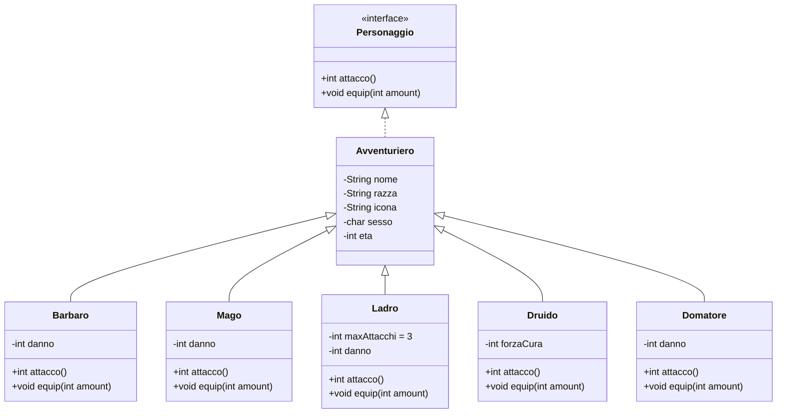

# JavaQuest

Progetto in java per l'esame dell'ITS.

JavaQuest e' un gioco di ruolo (RPG) molto basilare scritto in Java composto da 10 livelli, ognuno dei quali è diviso in due parti:

-  **Evento** in cui si trova un’arma casuale, la quale puo' essere equipaggiata se nella squadra e' presente un personaggio adatto;

-  **Combattimento** contro una squadra di massimo 3 mostri generati casualmente. Se la somma del valore di attacco della squadra del giocatore e' superiore a quella della squadra nemica, il giocatore vince il combattimento e potra' proseguire al livello successivo

Al termine dei 10 livelli il giocatore ha vinto.

# Traccia

Sviluppare un sistema di gestione in Java che utilizzi i principi della programmazione a oggetti. Gli studenti hanno la libertà di scegliere il dominio di applicazione del sistema: ad esempio, può trattare di una biblioteca, di un negozio online, della gestione delle prenotazioni di un cinema, delle ordinazioni di un ristorante, di una scuola, ecc... Includere un piccolo documento di presentazione che spieghi il dominio scelto, le funzionalità implementate e come utilizzare il sistema.

## Requisiti

Definire almeno cinque classi, di cui:

- Almeno una deve essere una classe astratta e almeno una la deve estendere.

- Almeno una deve essere un’interfaccia e almeno una la deve implementare.
  
  Per ognuna di queste classi, occorre:

- Definire almeno tre variabili di istanza.

- Definire i metodi necessari per l’utilizzo della classe (costruttori, get, set, equals,
  clone, toString).

Inoltre, almeno una delle classi deve:

- Definire come variabile di istanza un oggetto di un’altra classe.

- Definire un ArrayList.

- Definire una variabile statiche.

- Definire un metodo statico.

Tra le varie classi, devono essere implementate almeno quattro funzionalità legate al dominio specifico.

Definire un programma che implementi un’interfaccia a riga di comando consistente in un menù che consenta di interagire con il sistema e scegliere quali operazioni svolgere. Nella scrittura delle classi, occorre sempre tenere conto di:

- Utilizzare in maniera corretta la gestione delle eccezioni.

- Effettuare gli opportuni controlli di validità in tutti i punti del sistema.

- Avere una corretta struttura del progetto utilizzando i package.

- Essere ben documentato, sia nel codice sia fornendo la documentazione Javadoc creata.

# Documentazione

Il progetto e' stato creato utilizzando IntelliJ Idea.

## Premessa: termini del progetto

In quanto gioco di ruolo, il progetto usa alcuni termini che potrebbero generare confusione. Ecco pertanto alcuni chiarimenti:

- **Party**: una squadra di avventurieri.

- **Classe**: il "ruolo" dell'avventuriero all'interno del party. Per evitare confusioni con le classi di java, d'ora in avanti queste ultime saranno formattate come codice (es: `Classe`).

## Struttura

Tenendo a mente che i file che iniziano con la maiuscola sono Classi e quelli che iniziano con la minuscola sono pacchetti, la struttura del progetto e' la seguente:

- avventura
  
  - mondo
    
    - Combattimento
    
    - Livello
    
    - Mostro
  
  - umani
    
    - Avventuriero
    
    - Barbaro
    
    - Domatore
    
    - Druido
    
    - Ladro
    
    - Mago
    
    - Personaggio
  
  - Metodi
  
  - Ui

- Main

### Package umani

Il `package` umani e' composto da un'`interfaccia` Personaggio, che implementa la `classe` astratta Avventuriero.



Per implementare una classe degli avventurieri, quindi, bisogna far si che essa estenda Avventuriero e che definisca i metodi `int attacco()` e `void equip(int amount)`.

Spesso il valore restituito da `attacco()` e' dettato da una variabile di istanza, come ad esempio `int danno` o `int forzaCura`, in modo tale da poter restituire un valore che verra' usato nella fase di combattimento. Nota che se il valore restituito e' negativo, esso sara' letto come una cura.

Con il metodo `equip(int amount)` si cambia una variabile di istanza della `classe` in modo tale da modificare il valore restituito da `attacco()`.

### Package mondo

Il package mondo contiene le classi utilizzate per il progresso del gioco.

#### Classe Livello

La `classe` Livello serve per creare un `oggetto` di tipo `Livello`, il quale tiene traccia della progressione del gioco (segnata dalla variabile di istanza `int numLivello`) genera un'arma dal danno casuale, il quale verra' poi passato come parametro al metodo `equip(int amount)` delle sottoclassi di `Avventuriero`.

#### Classe Mostro

I mostri sono i nemici del gioco. Ognuno di questi ha un'icona che li contraddistringue e un danno, il cui valore dipende da una generazione casuale di un intero sommata a `numLivello`.

#### Classe Combattimento

La classe Combattimento e' una classe che contiene solo due metodi statici.

L'unico pubblico e' `boolean combattimento()`, il quale ha come argomenti un'arraylist di `Avventuriero` e un'arraylist di `Mostro` e restituisce, come valore booleano, l'esito del combattimento (*true* se il giocatore ha vinto, *false* se ha perso).

Per prima cosa calcola e mostra il danno dei nemici, poi quello del party del giocatore ed infine richiama il metodo privato `displayCombattimento()`, il quale mostra una griglia rappresentante da un lato il party di Mostri nemico e dall'altro il party del giocatore, dove l'icona di ogni Mostro e Avventuriero e' seguita dal danno che esso infligge. Esempio:

```
----👺----👻----🧌----
    3     5     3
         ⚔️️
    6     4     3
----🪓----🗡️----🪄----
```

Nel caso di pareggio, il vincitore sara' estratto casualmente.

### Classe Ui

La classe ui contiene metodi pubblici che stampano lunghe sequenze di caratteri che servono una funzione puramente estetica.

### Classe Metodi

La classe metodi contiene metodi richiamati dal Main o da altre classi e sono stati messi li per rendere il codice piu' pulito e organizzato.

I piu' importanti sono:

- `boolean checkPartyClass(ArrayList<Avventuriero> party, String nomeClasse)`: restituisce *true* se nel party passato come parametro esiste un `Avventuriero` il cui nome del tipo dinamico corrisponde a `nomeClasse`.

- `partyInit(ArrayList<Avventuriero> party, int membriParty)`: cicla per `membriParty` volte, facendo inserire all'utente le caratteristiche e la classe dell'Avventuriero da inserire nel party.

- `randomParty(ArrayList<Avventuriero> party, int membriParty)`: genera un arraylist di massimo 5 membri scegliendo casualmente tra dei membri preimpostati.

### Classe Main

La `classe` `Main` racchiude il corpo principale del programma e si occupa di chiamare i metodi di prima precedentemente descritti.

Il corpo del mail viene fatto ciclare in un `do while` per permettere all'utente di ricominciare una nuova partita una volta raggiunta la schermata di "game over".
